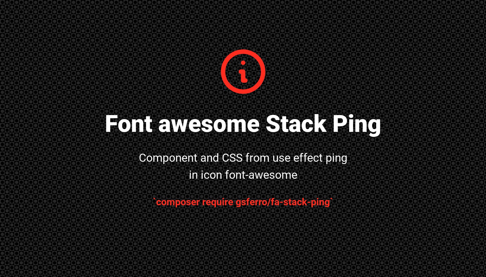

### Instalação

```composer 
composer require gsferro/odometer-easy && php artisan vendor:publish --provider="Gsferro\OdometerEasy\Providers\OdometerEasyServiceProvider" --force
```

css para aplicar efeito ping em icon font awesome como forma de status, como online ou offline por ex, e até outros icones e cores, colocando no fundo o efeito de ping.

Utiliza o conceito de `Stacked Icons`

- Exemplos Cores:

```text
"success",
"red",     
"yellow",  
"gray",
```

- Exemplos Icons:

```text
"circle",
"square",
"asterisk",
```

- Fazer Rotação 45º

```text
fa-rotate-45
```

### Dependencias: 

- minimo [font awesome 4](https://fontawesome.com/v4/)

### HTML:

Adicione o css ao head do seu html e utilize o codigo abaixo

- Agnostico:
```html
<-- status online -->
<span class="fa-stack-ping" data-toggle="tooltip" data-original-title="online">
  <i class="fa fa-circle fa-stack-1x text-success"></i>
  <i class="fa fa-circle fa-stack-1x text-success fa-animate-ping"></i>
</span>
```

```html
<-- status offline -->
<span class="fa-stack-ping" data-toggle="tooltip" data-original-title="offline">
  <i class="fa fa-circle fa-stack-1x text-red"></i>
  <i class="fa fa-circle fa-stack-1x text-red fa-animate-ping"></i>
</span>
```

- Laravel (parametrizado)

Crie um arquivo de componente para reutilização

```html
<span class="fa-stack-ping" @isset($title) data-toggle="tooltip" data-original-title="{{ $title }}" @endisset>
  <i class="fa fa-{{ $fa ?? "circle" }} fa-stack-1x text-{{$text ?? "success"}}"></i>
  <i class="fa fa-circle fa-stack-1x text-{{$text ?? "success"}} fa-animate-ping"></i>
</span>
```
